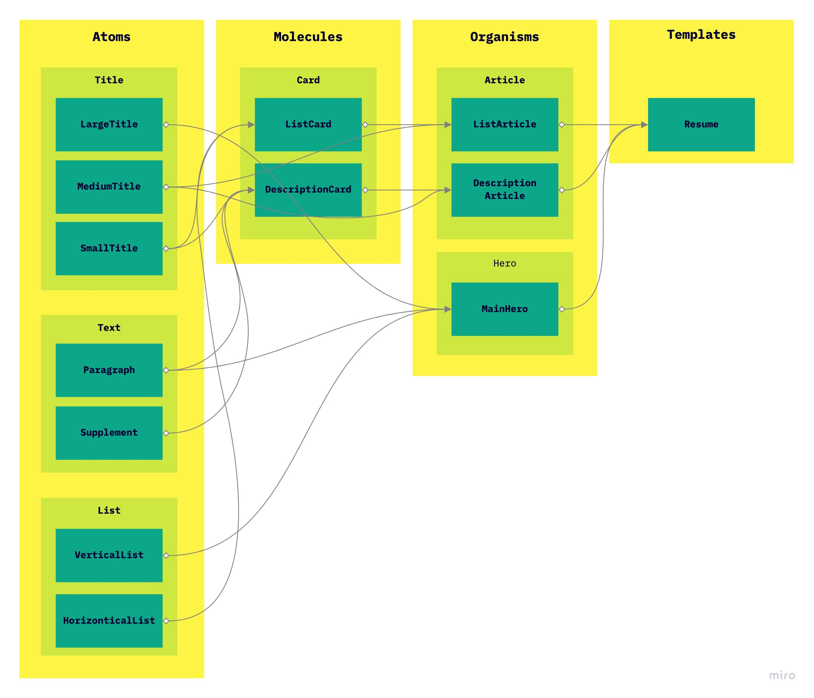
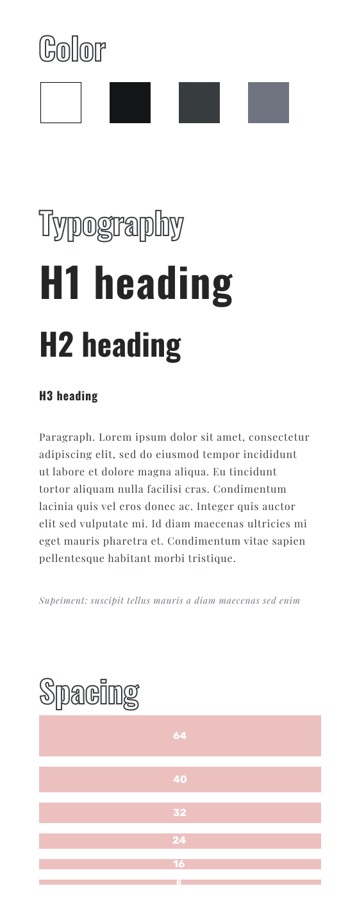
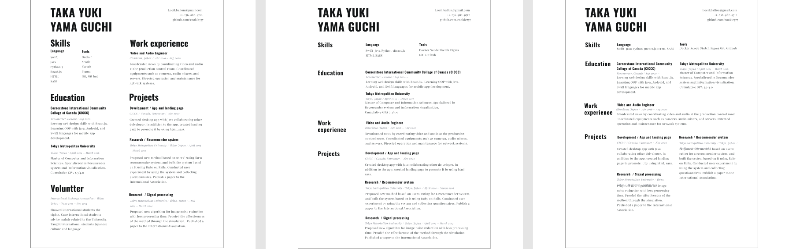
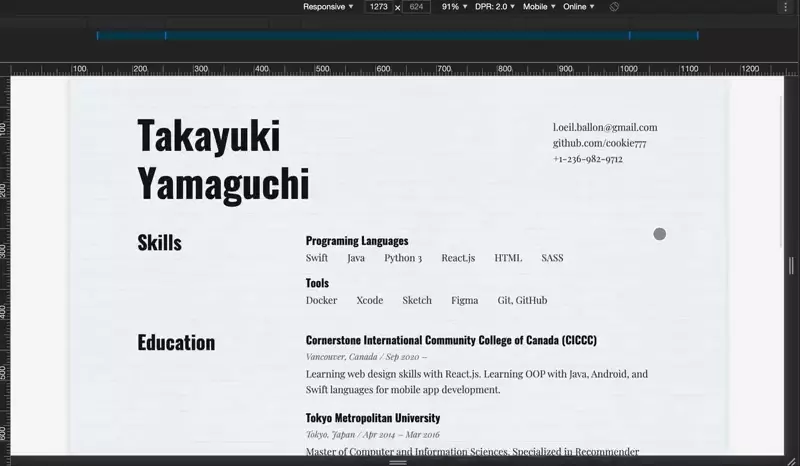
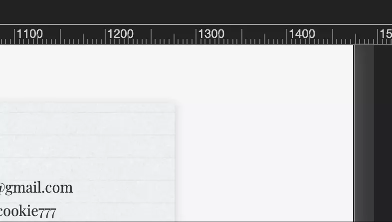

# Resume

- This is a super simple web project that represents my resume.
- Regardless of its simplicity, it includes very fundamental and vital tech used in the front end, such as
    - React.js
    - Atomic design pattern
    - Styled component
    - Responsive design
    

# Atomic design pattern

- To make an efficient and reusable website, I applied the Atomic design pattern.
- First, I created a very basic component as atoms, such as `Large Text` and `Small Text`.
- Then, created modules that are the combination of atoms
- Finally, created higher-level pages by assembling those modules and atoms



# Embedded styled component

- To realize the atomic design, I also used styled component instead of using plane CSS and SASS
- Each atomic is a combination of react component and styled-component
- Example code: when you want to create a medium title (heading), it is realized by one component which is a combination of "styled-components" and "React-function"


```javascript
const H2 = styled.h2`
        margin-top:-0.5rem;
        margin-bottom: 1.5rem;
        font-size: 2rem;
        font-weight: 700;
        font-family: Oswald, sans-serif;
        line-height:128%;
        color: ${styledVariables["secondary-color"]};
`;

function MediumTitle(props){
    return(
        <H2>{props.children}</H2>
    );
}
```

# Style guide
- To realize the atomic design, I first created a style guide
- By creating the style guide is deeply connected to component(atoms)
- I created 3 types of mock-up and ask my neighbors and colleagues that which is best




# Responsive
### Break points
- To make it readable on multiple devices, this website has a responsive design

 


- To realize this, I set four break-points common used in 2020 and created a function so that I can easily call and use it
- How I set breakpoints

```javascript
const breakpoints = {
        sm: 575.98,
        md: 767.98,
        lg: 991.98,
        xlg:1199.98
}

export const mq = (width) => {
    return(
        style => `@media (max-width: ${breakpoints[width]}px) { ${style} }`
    );
}
```

- Usage example: by wrapping `${mq({parameter})` //code  `};`, you can easily use and manage breakpoints.
```javascript
const Grid = styled.div`
    // other codes
    ${mq("lg")`
        display: block;
        margin-bottom:4rem;
    `};
`;
```
- Usually these days, we use mobile-first as breakpoints, but this time I adopted "desktop first" because the resume is supposed to see as letter size

### Keep the aspect ratio
- To realize the precise letter size of ration, which is `1: 1.2941`, I used `calc` and `max` features.

1. As long as the resume width is 1080px, I want to keep the real letter ratio, and when the width gets smaller than 1080px, I allow the ratio to collapse so that it can contain all the contents. (which means responsive)

```css
    max-height: max(calc(1080px * 1.2941), calc(1080px * 1.2941 + calc( 1080px - 100vw )* 100));
```
- This code enables that when the view width is more than 1080px, it keeps the height `calc(1080px * 1.2941)`, and when the width gets less than 1080px, the height gets larger than 1080px * 1.2941
- This is possible because when the view width is less than 1080px, `calc( 1080px - 100vw )` gets positive and added to `1080px * 1.2941 `, which means it gets larger than 1080px * 1.2941.

2. To make a better resume, I always try to set spaces(margin) horizontally. 
When the view width is large enough, I let it to have natural space like center align. When it gets shorter, I intentionally set margin 1rem.

```css
    margin: 4rem max(1rem, calc((100vw - 1080px)/2));
```
- `calc((100vw - 1080px)/2)` let resume to have 1080px with enough space.
- When the spaces gets shorter, it will still keep 1rem.




